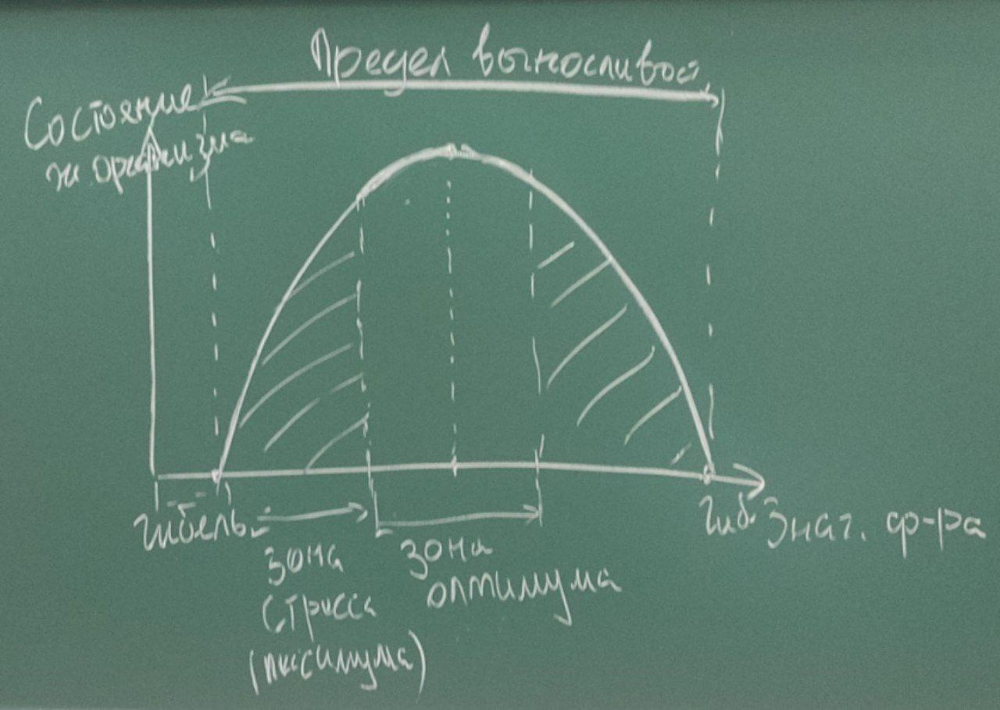

# ЛЕКЦИЯ 3

# Биосфера (продолжение)

Биосфера (1875 год).

Вернадский --- основной вклад.

## Строение биосферы по Вернадскому

**Биосфера** --- оболочка Земли, созданная взаимодействием косного и живого
вещества.

Части биосферы:

1. **Живое вещество** --- вся совокупность биомассы на нашей планете.

2. **Косное вещество** --- все биологические образования, которые были созданы
   без участия живых организмов (горы, впадины).

3. **Биокосное вещество** --- комплексы тесно взаимодействующих друг с другом
   косного и живого вещества (например, почва).

4. **Биогенное вещество** --- биологические образования, созданные в
   результате жизнедеятельности живых организмов (песчанники,
торфянники, нефть).

## Атмосфера

Воздух.

**Атмосфера** --- газовая оболочка (удерживается притяжением).

Плавный переход в космос.

Линия Кармана (100 км)

Возникла:

* испарение;
* извержения.

Слои:

* планетарно-пограничный;
* тропосфера;
* тропопауза;
* стратосфера (защита от ультрафиолета);
* стратопауза;
* мезосфера;
* мезопауза;
* термосфера (линия Кармана);
* термопауза;
* экзосфера.

Газы:

* кислород;
* углекислый газ;
* азот;
* и тд.

## Гидросфера

## Литосфера

Литосфера --- твердая оболочка земли, включающая...

Строение:

* осадочный (вулканические горные породы, остатки органических веществ);
* гранит (литосферные плиты);
* базальт.

8 элементов:

* кислород (заполняет полости, ключевая роль в балансе давления);
* магний ???;
* ...
* сера;
* кремний;
* кальций;
* водород;
* углерод;
* фосфор.

### Связь литосферы, гидросферы и атмосферы.

...

### Экологические проблемы.

Загрязнение почвы. Источник: бытовой мусор, .

Медленно самоочищается, медленнее, чем загрязняется.

## Функции живого вещества по Вернадскому

* газовая (количественный и качественный состав атмоферы обусловлен
  жизнедеятельностью живых организмов);
* концентрационная (накапливание веществ в организмах);
* окислительно-восстановительная;
* биохимическая (рост, размножение, распространение живых организмов).
  
## Роль живого вещества в биосфере

Миграция химических элементов на земной поверхности и в биосфере в целом
осуществляется или при непосредственном участии живого вещества, или она
протекает в среде, особенности которой обусловлены живым вещством, как
тем, которое в настоящее время населяет биосферу, так и тем, которое
действовало на земле в течение всей биологической истории.

# Экологические факторы среды

**Экологический фактор** --- любой элемент или свойство среды, способное
оказывать прямое или косвенное влияние на живые организмы.

Факторы:

* неживой природы;
* биотические (живой природы); 
* антропогенные (человеческой деятельностью). 

Классификация:

* по периодичности:
    * строго периодические (смена дня и ночи, сезонов, приливы/отливы);
    * без строгой периодичности (время от времени, не носят характер
      регулярности: наводнения, землетрясения);
* по направленности:
    * в определенном направлении, по определенным параметрам (изменение
      температуры, заболачивание);
    * неопределенного действия (результат которых не удается предсказать,
      например, атропогенные).

Общие закономерности действия факторов

