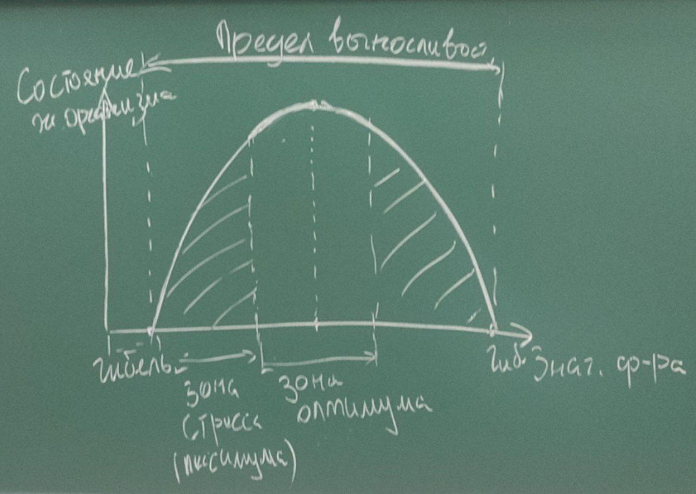

# ЛЕКЦИЯ 3

# Биосфера (продолжение)

Биосфера (1875 год).

Вернадский --- основной вклад.

## Строение биосферы по Вернадскому

**Биосфера** --- оболочка Земли, созданная взаимодействием косного и живого
вещества.

Части биосферы:

1. **Живое вещество** --- вся совокупность биомассы на нашей планете.

2. **Косное вещество** --- все биологические образования, которые были созданы
   без участия живых организмов (горы, впадины).

3. **Биокосное вещество** --- комплексы тесно взаимодействующих друг с другом
   косного и живого вещества (например, почва).

4. **Биогенное вещество** --- биологические образования, созданные в
   результате жизнедеятельности живых организмов (песчанники,
торфянники, нефть).

## Атмосфера

Воздух.

**Атмосфера** --- газовая оболочка (удерживается притяжением).

Плавный переход в космос.

Линия Кармана (100 км)

Возникла:

* испарение;
* извержения.

Слои:

* планетарно-пограничный;
* тропосфера;
* тропопауза;
* стратосфера (защита от ультрафиолета);
* стратопауза;
* мезосфера;
* мезопауза;
* термосфера (линия Кармана);
* термопауза;
* экзосфера.

Газы:

* кислород;
* углекислый газ;
* азот;
* и тд.

## Гидросфера

## Литосфера

Литосфера --- твердая оболочка земли, включающая...

Строение:

* осадочный (вулканические горные породы, остатки органических веществ);
* гранит (литосферные плиты);
* базальт.

8 элементов:

* кислород (заполняет полости, ключевая роль в балансе давления);
* магний ???;
* ...
* сера;
* кремний;
* кальций;
* водород;
* углерод;
* фосфор.

### Связь литосферы, гидросферы и атмосферы.

...

### Экологические проблемы.

Загрязнение почвы. Источник: бытовой мусор, .

Медленно самоочищается, медленнее, чем загрязняется.

## Функции живого вещества по Вернадскому

* газовая (количественный и качественный состав атмоферы обусловлен
  жизнедеятельностью живых организмов);
* концентрационная (накапливание веществ в организмах);
* окислительно-восстановительная;
* биохимическая (рост, размножение, распространение живых организмов).
  
## Роль живого вещества в биосфере

Миграция химических элементов на земной поверхности и в биосфере в целом
осуществляется или при непосредственном участии живого вещества, или она
протекает в среде, особенности которой обусловлены живым вещством, как
тем, которое в настоящее время населяет биосферу, так и тем, которое
действовало на земле в течение всей биологической истории.

# Экологические факторы среды

**Экологический фактор** --- любой элемент или свойство среды, способное
оказывать прямое или косвенное влияние на живые организмы.

Факторы:

* неживой природы;
* биотические (живой природы); 
* антропогенные (человеческой деятельностью). 

Классификация:

* по периодичности:
    * строго периодические (смена дня и ночи, сезонов, приливы/отливы);
    * без строгой периодичности (время от времени, не носят характер
      регулярности: наводнения, землетрясения);
* по направленности:
    * в определенном направлении, по определенным параметрам (изменение
      температуры, заболачивание);
    * неопределенного действия (результат которых не удается предсказать,
      например, атропогенные).

Общие закономерности действия факторов

# ЛЕКЦИЯ 4

**Лимитирующий фактор** --- это любой фактор или условие среды, приближающийся у
пределу устойчивости (толерантности) или превышающий его.

## Закон минимума (или Либиха ???)

При стационарном или стабильном состоянии экологических факторов лимитирующим
будет тот из них, значение которого близко к необходимому минимуму.

## Закон толерантности

Любой живой организм имеет определенный верхний и нижний пределы устойчивости к
любому экологическому фактору.

Эврибионты --- организмы выдерживающие большие вариации значения действующего
фактора без существенных изменений процессов жизнедеятельности.

Стенобионты--- организмы с узким пределом выносливости по отношению к тому же фактору.

## Взаимодействие факторов

1. Аддитивность --- суммирование эффектов влияния различных факторов.
2. Синьорвизм --- обоюдное усиление действия различных факторов.
3. Антоганизм --- взаимное ослабления действия различных факторов.

## Экологическая ниша

Экологическая ниша --- совокупность всех факторов среды, в пределах которой
возможно существование вида в природе. 

Виды:

* пространственная --- ниша места обитания, которая показывает адрес проживания
  этого организма;
* трофичекая --- особенности питания организма и показывает профессию этого
  организма в биологическом сообществе.

Экологическая ниша организма определяется как n-мерный гиперобъем, охватывающий
полный диапазон условий, в которых организм может успешно воспроизвести себя.

Совокупность оптимальных для организма условий.

## Абиотические факторы среды

Факторы неживой природы.

# ЛЕКЦИЯ 5

> 12.03.2022

**Биотические факторы** (факторы живой природы) --- совокупность влияний
жизнедеятельности одних организмов на другие.

Каждый биологический вид способен жить только в той среде, где связь с другими 
видами осуществляет необходимые условия.

## Классификация по происхождению (взаимному влиянию)

* Зоогенные факторы --- факторы взаимодействия между животными организмами.
* Фитогенные факторы --- факторы взаимодействия растительных организмов.
* Антропогенные факторы. 

## Классификация зоогенных факторов

* Гомотипическая реакция --- взаимодействие между особями одного вида.
    * Групповой эффект --- выражается в повышении жизнеспособности
      организмов при их объединении в группу.
    * Массовый эффект --- вызывается негативными изменениями в среде обитания,
      происходящие при повышении численности и плотности популяции выше
      критического уровня.

      ### Принцип Олли

      Для каждого вида существует оптимальный размер группы и оптимальная
      плотность популяции; как перенаселенности и недонаселенность оказывают
      неблагоприятное влияние.

    * Внутривидовая конкуренция
* Гетеротипическая реакция --- взаимодействие между особями разных видов.
    * Нейтрализм --- взаимоотношение между видами, занимающими одну
      территорию, но почти не оказывающие влияния друг на друга.
    * Неблагоприятные:
        * Хищничество --- один вид организмов уничтожает другой для употребления
          в пищу.
        * Паразитизм --- тип взаимодействия, при котором один из видов
          существует за счет органического вещества получаемого от другого
          организма (паразит --- хозяин).
          На поверхности организма --- ...
        * Межвидовая конкуренция --- взаимодействие двух или нескольких видов,
          стремящихся получить один и тот же ресурс.
            * Прямая конкуренция осуществляет путем прямого влияния особей друг
              на друга;
            * Косвенная конкуренция.

            ### Закон Гаузе

            Победителем в конкурентной борьбе оказывается тот вид, который в
данной экологической обстановке имеет хотя бы небольшие преимущества перед
другим видом, а следовательно и большую приспособленность к условиям окружающей
среды.
        * Симбиоз --- взаимоотношение видов, выгодное для них обоих.
        * Мутуализм??? --- вид взаимоотношений, когда присутствие партнера
          является жизненнонеобходимым (термиты, жгутиковые бактерии).
        * Каменсализм (нахлебничество) --- взаимоотношений, при которых только
          один из партнеров получает выгоду, не нанося ущерб другому.

Патогенные факторы:

* Прямые механические взаимодействия.

...

## Антропогенные факторы

--- прямые или косвенные воздействия человеческой деятельности на природную
среду, вызывающие изменения ... и здоровья населения.

Прямые --- непосредственное воздействие человека (охота, рыбалка, вырубка лесов).
Косвенные (антропотехногенные) --- загрязнение среды, бла-бла-бла.

### Физические факторы

* ...
* радиация;
* шумовое загрязнение;
* тепловое загрязнение.

### Химические факторы

* тяжелые металлы;
* диоксины и их производные;
* пестициды;
* ПАУ --- полициклические аглотические углеводороды;
* нитриты и нитраты.

# Лекция 6

Тут было про физ и хим факторы (про каждый) 

# Лекция 7

### Биологические антропогенные факторы

Биологические антропогенные факторы --- это все виды биологического вторжения в
... и организм человека, приводящие к нарушению их адаптивных возможностей,
патологическим заболеваниям и деградации.

Инродукция --- случайное или намеренное переселение организмов в природные или
аграрные экосистемы, в которых ранее их не было.

Эвтрофикация водных экосистем --- поступление в водоемы большого количества
органического веществ.

# Лекция 8

> 02.04.2022

...

Групповые свойства:

* плотность
* рождаемость
* смертность
* ...

## Плотность популяции

Плотность -- численность популяции, отнесенная к единице пространства.

Два вида:

* экологическая (численность или биомасса на единицу обитаемого пространства,
    на которой вид может существовать).
* средняя плотность (величина популяции, отнесенная к единице пространства в 
    в географических пределах существоварния или обитания популяции).

## Рождаемость

Рождаемость -- скорость увеличения численности популяции за счет появления на
свет новых организмов.

b = delta N / (delta t)

Используется только для одной конкретной популяции.

Для сравнения не подходит.

b = delta N / (N delta t)

Вот это для сравнения.

Максимальная (потенциальная) рождаемость -- теоретический максимум появления на
свет новых организмов в идеальных условиях.

## Смертность

Смертность -- число особей погибших за определенных период.

d_общ = (delta M) / (delta t)

d_уд = (delta M) / (M delta t)

Экологическая (релизовнная смертность) -- число погибших особей в конкретных
условиях

Минимальная смертность -- теор минимум, которых характеризует гибель особей в
идеальных условиях (отсутсвие внешних факторов, которые могли привести к
дополнительной смертности) -- смерть от старости.

## Выживаемость

c = 1 - d

Кривые выживания -- ...

## Возрастная стуктура популяции

Соотношение в популяции особей разных возрастов.

Категории возрастных групп:

* предрепродуктивные (молодые особи, неспособные принимать участие в размножении);
* репродуктивные (способные принимать участие в размножении);
* пострепродуктивные (старые особи, утрачившие способность принимать участие в
  размножении).

Развивающаяся популяция

ФОТО

Популяция с равномерным ростом ???

ФОТО

Угасающая популяция

## Рост численности популяции

Рождаемость больше чем смертность

Биотический потенциал -- это генетически обсловленная максимальная теоретически
возможная скорость роста.

r = b_max - d_min (удельные)

Экспоненциальный рост -- избыток ресурсов, ... и в течение некоторого времени
смертность не увеличивается?

dN/dt = rN

Емкость среды -- максимальное возможное число организмов в популяции, способных
комфортно развиваться в данной среде.

            _   _

             \ /

Саранча.    (0∨0)

Затухающий рост

dN/dt = rN(K - N)/K

Лаг-фаза -- крайне медленный рост, обусловленый адаптацией организмов к условиям
среды.

## Экологическая стратегия

Это совокупность приспособлений организмов обеспечивающих максимально возможную
численность популяции данного вида в конкретном сообществе.

* r-виды придерживаются экспоненциального роста (r-стратегия);
* k-виды придерживаются затухающего роста (k-стратегия).

|Показатель|r-виды|k-виды|
|-|-|-|
|Рождаемость|Высокая, не зависит от плотности популяции|Низкая, зависит ...|
|Конкурентноспособность|Низкая|Высокая|
|Кривая выживания|2 типа (вогнутая)|1 и 3 типа|
|Кривая роста|J-образная|S-образная|
|Продолжительность жизни|Короткая (менее 1 года)|Долгая (более одного года)|
|-|Быстрая, широкомасштабная|Медленная|
|Забота о потомстве|Нет|Есть|
|Примеры|Грызуны, бактерии, однолетние растения|Млекопитающие, многолетние
растения|
