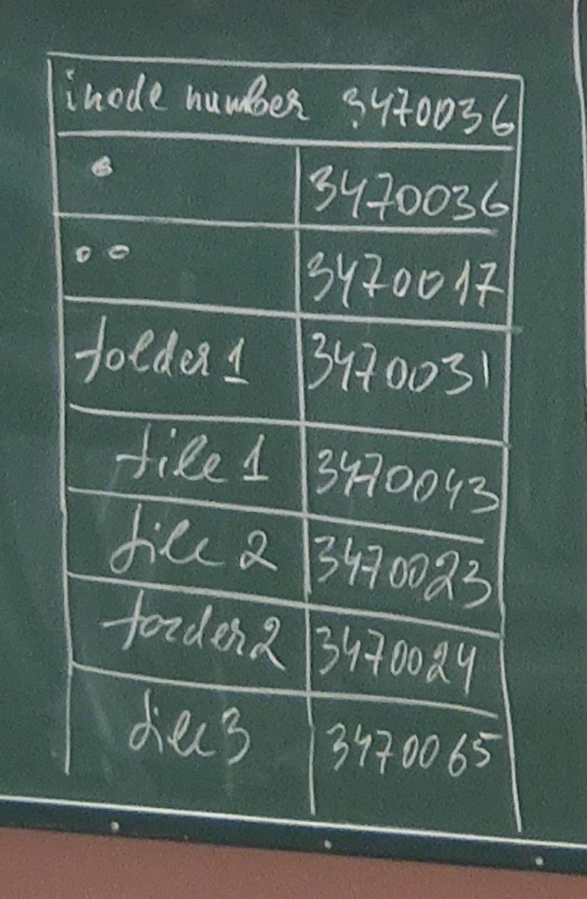
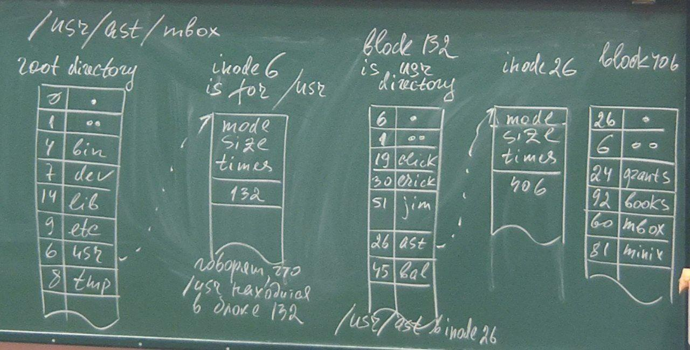

# Лекция 2

монтирование --- это система действий, в результате которой файловая система
становится доступной.

Для монтирования ФС требуются права привилегированного пользователя.

Используется команда mount.

`mount ключи -t тип_файловой_системы -o опции_файловой_системы устройство
каталог_назначения`

Отмонтирование:

`umount ключи -t тип_файл_сист -o опции_ф_с`

Кроме основной команды есть две команды: там могут указываться имя ФС.

`mount.nfs`

Есть разные версии.

Винда:

`mount.ntfs`

Наиболее часто:

* имя устройства или другого ресурса, который содержит монтируемую ФС;
* точка монтирования --- каталог, к которому подмонтируется ФС; должна
  существовать, иначе ошибка.

Когда ФС смонтирована в существ. дир., все файлы и поддир. этой
смонтированной системы становятся файлами и поддир точки монтирования.

Если дир. тм содержала к-л. файлы и поддир, то они не теряются, а становятся
невидимыми.

Иногда может оказаться нужным явно указывать при монтировании тип ФС (опция
-t).

Например, если осуществляетя попытка подмонтированить новую ФС, имеющую
новый тип, но поскольку U/L могут поддерживать большое количество
ФС (они могут поддерживать ФС разных типов), ... структуру ФС.

Рассмотрим пример.

```bash
# mount /dev/sda1 /mnt
```

Пытается монтированть устройство /dev/sda1 с файловой системой ext3 в каталог
mnt с режимом только чтение.

Если нет библиотек для поддержки той или иной ФС, или система не является ext3,
будет выведено сообщение о невозможности монтирования.

Если необходимо включить режим только записи:

```bash
# mount -o rw /dev/sda1 /mnt
```

Структура superblock предназначена для описания подмонтированных ФС.

Она содержит всю необходимую инф-цию для обращения к файлам конкретной ФС.

struct inode --- дескриптор физ. файла.

struct dentry --- описывает элемент каталога (доступ к файлам).

struct file --- описывает открытый файл (открыт к-л процессом).

Для системы существуют только процессы, их она обслуживает, ими она
управляет.

Команды, которые мы пишем в ком строке --- коды системы, которые ей
выполняются.

**ЗДЕСЬ ДОЛЖНА БЫТЬ ФОТКА. ТАК ВАНЯ СКАЗАЛ.**

Кеши по своему назначению хранят данные, к которым били последние
обращения, по принципу lru, по принципу наибольшей вероятности обращений.

Для деятельности человека хар-но, что он обращался к данным, то в след
момент, он будет обращаться к этим же данным.

Системная таблица открытых файлов. В этой таблице --- десрипторы всех
открытых в системе файлов, если файл открыт несколько раз, то будет
существовать соотв. кол-во дескрипторов файлов.

Т. к. дескрипторы --- структура для обслуживания
...............................................................................
.................................................

Одно имя --- для системы это хардлинк.

## СуперБлок

Раздел жесткого диска (всторичной памяти) с ФС ext2.

Блок -- минимально адресуемая единица физ. носителя (вторичной памяти).

ФС предназначена для долговременного хранения и доступа к файлам. Без доступа
никому не нужно.

Доступ многоуровневый. Втор. память --- внешнее устройство.

Дисковые inode содержат информацию об адресах блоках втор. памяти, в которой
находится файл, кот. описывается конкретным inode-ом.

inode корневого каталога...

Суперблок хранит инфомацию об inod-ах, обеспечивает доступ к дисковому айноду,
а дисковый айнод хранит информацию об адресах.

**ЗДЕСЬ ДОЛЖНА БЫТЬ СУПЕРСХЕМА СУПЕРБЛОКА**

Суперблоки в системе объединены в списко. В системе столько действующих
суперблоков, соклько смонтированно ФС. Мб смонитрованно несколько ФС одного и
того же типа.

Доступ к файлам возможен только в смонтированной ФС, нужен соотв. суперблок.

```c
struct super_block
{
    struct list_head s_list;
    dev_t s_dev;
    unsigned long s_blocksize;
    struct file_system_type *s_type; \\ структура file_system_type предназначена для
                                     \\ регистрации типа конкретной ФС
    const struct super_operations *s_op;
    unsigned long s_flags;
    unsigned long s_magic;
    struct dentry *s_root;
    struct rw_semaphore s_umount;
    struct list_head s_mount;
    struct block_device *s_bder;
    ...
    struct list_head s_inodes_wb;
}
```
Грязный файл --- измененное значение.
**PHOTO AGAIN**

# Лекция 4

> 02.04.2022

```
struct inode_operations
{
    ...
    int (*create)(struct inode *, struct dentry *, umode_t, bool);
    ...
    int (*mkdir)(struct inode *, struct dentry *, umode_t)
    int (*rmdir)(struct inode *, struct dentry *);
    int (*mknod)(struct inode *, struct dentry *, umode_t, dev_t);
    int (*rename)(struct inode *, struct dentry *, struct inode *, struct
dentry *);
    ...
    int (*atomic_open)(struct inode *, struct dentry *, struct file *,
unsigned open_flag, umode_t create_mode, int onened);
}
```

Поиск указанного индекса в указанном каталоге

permition -- проверяет права доступа к указанному файлу, на который ссылается
inode.

Если доступ разрешен, то функция возвращает 0, иначе -1.

Для большинства файловых систем устанавливается в Null, и в этом случае
используется метод, определенные в ВФС.

Сравнение битовых полей режима доступа с указанной маской.

link -- жесткая
softlink -- гибкая ссылка

create вызывается open (open(2) и create(2)), то есть create вызывается этими
двумя системными вызовами, только в случае, если вы вызывается open и create
для обычного файла, при этом создается новый inode с указанным режимом доступа
mode и этой inode связан с элементом пути, то есть dentry. Про параметр bool
истрия умалчивает.

mkdir -- создаем директорию

mknod -- можно создать именованный канал, файл устройства или сокета.

Информация о созданном устройстве будет хранится в параметре dev_t.

atomic_open вызывается из open, при этом файл или создается, или открывается
одной неделимой операцией.

> Важно! Эти функции перечислены в `struct inode_operations`

```
struct inode
{
    const struct inode_operations *i_op;
    ...
}
```

Обращение к функции operations

```
inode->i_op->permission(...);
```

Для доступа к файлу необходимо получить его inode, тк индекс inode --
идентификатор.

При этом необходимо понимать, что для доступа к файлу имя файла
необязательно знать, обязательно номер inode, а имя можно не знать.

<!--  -->

<p align="center">
  
</p>

## Как выполняется доступ к файлу?


/usr/ast/index

Начинаем с содержимого корневого каталога.

<!--  -->

<p align="center">
  
</p>

Дескриптор файла с определенными значениями полей. На дисковом inode
указываются адреса блоков, ...

Мы из inode с номером 6 определили, что нужная нам информация о директории
usr находится в блоке 132.  Это usr директория.

Говорят, что `/usr/ast` находится в блоке 406.

406 -- содержимое `/usr/ast`. 26 текущая, 6 родительская `/usr`

В системе есть inode дисковый (обязательно содержит информацию об адресах
блоков конкретного файла)

Копия индекса, которая находится в памяти, содержит поля, которых нет в
дисковом индексе:

1. В inode ядра (копия дискового, может не быть дискового, если это
   вирутальная ФС, которая не связана ни с каким внешним запоминающим
устройством).

1. Поля ответсвенные за блокировки
2. Логический номер устройства
3. Номер индекса -- поле `unsigned  long i_ino`, в дисковом индексе это поле
   не нужно, так как на диске индексы хранятся в линейном массиве и ядро
идентифицирует индекс по его смещению.
4. Ссылки на другие индексы, для организации в ядре хэш-очереди, кроме того ядро
   ведет список свободных индексов.
5. Счетчик ссылок на файл, в котором содержится число, указывающее,
   сколько раз был открыт этот файл.

Файл -- поименнованная совокупность данных, но когда процесс желает с ней
работать, для системы это будет открытый файл.

Для этого дополнительно сущесвтует структура struct file.

## Объект dentry

Роберт Лав. Операционная система Linux.

ВФС считает каждый каталог файлом, который содержит список других каталогов и
файлов.

Для работы с ... существует структура `struct dentry`.

При этом ядро создает объект dentry для каждого компонента пути, причем
такой объект создается "налету", когда процесс обращается к файлу.

Объект `detnry` связывает компонент пути с соотв индексом, или соотв inode-ом.

При поиске питу `/tmp/test` ядро создаст объект `dentry` для корневого
каталога, затем создаст объекст dentry для tmp и третий объъект dentry для
test.

У объекта dentry нет соотв отображения на диске.

# Лекция 5

> 16.04.2022

Один и тот же inode может иметь несколько ссылок, то поле `i_dentr` должно
представлять связный список.

Двухсвязный список ... и непритиворечивых ..

То есть там находятся объекты dentry к которым были последние обращения.

Добавление в этот двухсвязный список объекта dentry должно выполняться по
значению времени.

Новый объект dentry записывается в хвост, удаление с головы.

Каждый элемент таблицы dentry_hashtable (массива) является указателем на список
тех объектов dentry, которые соответсвуют какому-то ключу. Значение ключа
определяется функцией d_hash(), что позволяет для каждой файловой системы
реализовать свою hash-фунцкию. Поиск в хэш-таблице осуществляется функцией
d_lookup().

Приведенный пример показывает, что сначала идет поиск denty в кэше, если поиск
приводит к тому, что какого-то элемента каталога нет в кэше, то происходит
обращение таким образом каким-рассмотрели. Найденный объект dentry, его inode
будет помещен в кэш.

пропущено + фото

inode cache

В linux inode_cache -- в файле `fs/inode.c`

inode_cache представляет из себя глобальный cache-массив inode_hashtable, в
котором каждый inode хэшируется по значению указателя на суперблок. И номеру
inode-а. В случае отсутствия суперблока `inode->i_db == NULL` вместо хеш-массива
inode добавляется к двухсвязному списку `anon_hash_chain`. Примерами таких
анонимных inode-ов служат сокеты, которые создаются `sock_allock() //
(net/socket.c)`, которая вызывает функцию `get_empty_inode // (fs/inode.c)`

2.  inode_in_use содержит inode-ы, у которых i_count > 0 и i_nlink > 0.
inode-ы, которые создаются с помощью вызова функции get_empty_inode() и
get_new_inode() добавляются в этот inode.

3. inode_unused, для которых i_count = 0.

4. Также для каждого суперблока свой... продолжение письм.

struct file -- описывает открытые файлы.

Предоставляет информацию о файлах, кот были открыты процессами.

Это одна единственная таблица, недоступная пользователю.

Важнейшим моментом объяснения ситуации с открытыми файлами являетс процесс
открытия файла.

В различных структурах даже ядра имеются функции open.

